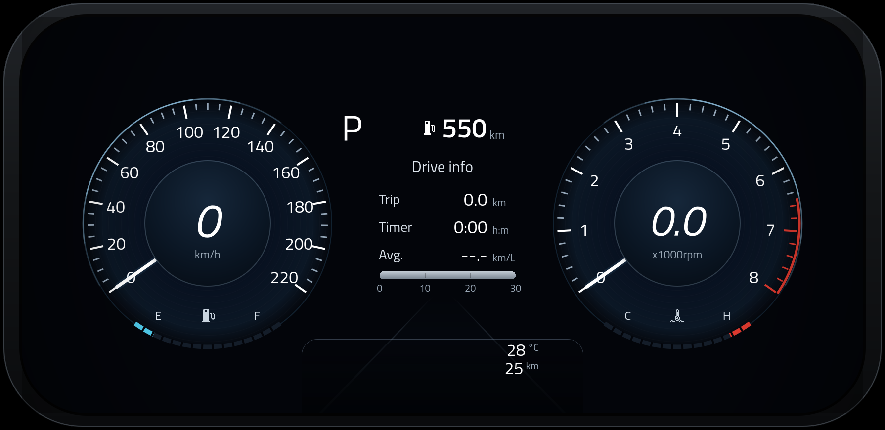
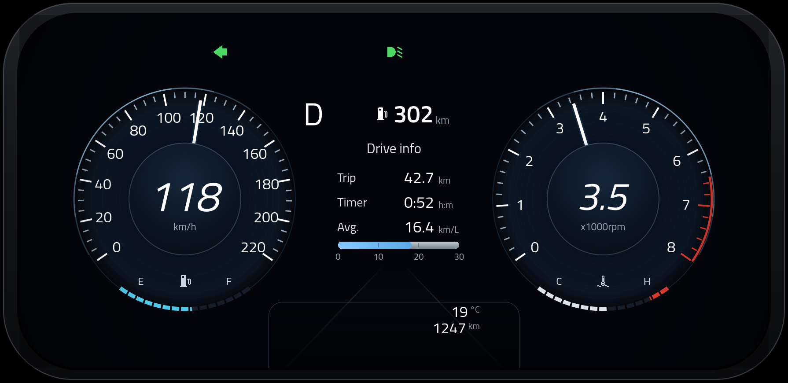

# Car HMI — digital instrument cluster

A working recreation of a modern car's digital instrument cluster, built with
**Qt Quick / QML** and **PySide6**, plus a separate **test panel** window that
feeds it input so every state can be exercised without a car.





---

## Running it

Requires Python 3.9+ on Linux (also runs on macOS and Windows).

```bash
git clone <this repo>
cd hmi
./run.sh
```

`run.sh` creates a local `.venv`, installs PySide6 into it, and launches both
windows. To do it by hand:

```bash
python3 -m venv .venv
source .venv/bin/activate
pip install -r requirements.txt
python3 main.py
```

### If Qt complains about missing libraries

PySide6 ships Qt itself but still needs a few system libraries. On
Debian/Ubuntu:

```bash
sudo apt install libegl1 libgl1 libxkbcommon-x11-0 libfontconfig1 \
     libdbus-1-3 libxcb-cursor0 libxcb-icccm4 libxcb-keysyms1 \
     libxcb-shape0 libxcb-xkb1 libxcb-render-util0 libxcb-image0
```

On Fedora: `sudo dnf install mesa-libEGL mesa-libGL libxkbcommon-x11 fontconfig`.

### Command line

| Flag | Effect |
| --- | --- |
| `--no-panel` | cluster only, no control panel |
| `--fullscreen` | open the cluster full screen |
| `--scale N` | force the render scale instead of fitting the window |
| `--screenshot FILE` | render one frame to a PNG and exit (works headless) |
| `--font FILE...` | start with your own typeface (files, or a folder of them) |

Keys in the cluster window: **F11** full screen, **Esc** leave full screen,
**B** show/hide the bezel.

---

## The two windows

**Cluster** — the display itself. Drawn on a fixed 1790x870 canvas and scaled
uniformly to whatever size the window is, so proportions never shift.

**Test panel** — the input side. Two ways to drive it:

- **Simulate** (default) runs a small vehicle model. Move the throttle, and
  engine torque goes through the gearbox to the wheels; the car accelerates
  against drag and rolling resistance, the automatic shifts, fuel burns,
  coolant warms up, and the trip computer fills in. The shift interlock is
  modelled too — you cannot leave `P` without the brake and a running engine.
- **Manual** pins `speed` and `rpm` to exact values so you can park the needles
  anywhere for a screenshot or an edge case.

Everything else — fuel, temperatures, lighting, doors, belts, every warning
lamp, cruise control, units — is settable at any time in either mode.

---

## What the cluster shows

**Gauges** — speedometer 0–220 km/h, tachometer 0–8000 rpm with a red band from
6500, segmented fuel and coolant arcs with reserve and overheat zones marked.

**Drive info** — gear (P/R/N/D, plus the held ratio in Sport), distance to
empty, trip distance, trip timer, average and instantaneous economy, odometer,
outside temperature.

**Telltales** — 30 lamps on the conventional severity order (red stop lamps
first, then amber cautions, then blue/green status): brake, park brake, oil
pressure, charging, coolant temperature, airbag, seatbelts, doors ajar, forward
collision, check engine, ABS, ESC and ESC off, traction off, EPS, TPMS, low
fuel, washer fluid, glow plug, immobiliser, lane departure, rear fog, high and
low beam, position lights, front fog, cruise control set and ready. Unlit lamps
take up no space, so an idle cluster shows an empty strip.

**Units** — metric or imperial throughout, and km/L, L/100km or mpg for economy.

**Drive modes** — Comfort, Eco, Sport and Smart, each with its own accent
colour; Eco and Sport also change the shift points and fuel burn.

---

## Using your own typeface

The **Typeface** section at the top of the test panel loads any font you point
it at, and the whole cluster restyles immediately — numerals, gauge labels,
drive info, odometer, everything.

- **Load font…** opens a file picker. Select a family's several styles at once
  (regular, italic, bold) — the cluster asks for italic numerals and a
  demi-bold range, so Qt otherwise has to synthesise them from the regular.
- Or type a path into the field and press **Apply**. A folder works too: every
  font file in it is loaded.
- **Use bundled** goes back to Titillium Web.

`.ttf`, `.otf`, `.ttc`, `.woff` and `.woff2` all work. The panel shows the
family name it resolved, a live preview in that font, and an explanatory
message if a file could not be read.

Your choice is remembered, so the cluster comes back up in your font next
time. If that file later moves or is deleted, the cluster falls back to the
bundled typeface and says so rather than failing to start.

You can also set it from the command line, which is handy for screenshots:

```bash
python3 main.py --font ~/fonts/Inter-Regular.ttf ~/fonts/Inter-Italic.ttf
python3 main.py --font ~/fonts/my-brand-family/
python3 tools/shoot.py shot.png --font ~/fonts/my-brand-family/
```

The control panel deliberately keeps the bundled font for its own labels. If
a loaded font turned out to be a symbol or display face, a panel rendered in
it would leave you no way to read the button that undoes the change.

---

### Checking that it really is your typeface

Loading a font is one thing; proving the shipped build is drawing it is
another. Qt does not fail when a family is missing — it silently substitutes
another one — so a cluster can come up looking approximately right and be
branded wrong.

`tools/text_dump.py` renders a frame and writes down everything it drew: every
string, where it landed in image coordinates, and which typeface Qt *actually*
resolved each one to.

```bash
python3 tools/text_dump.py frame.png --json frame.json \
    --set speed=118 rpm=3450 gearMode=D --font ~/fonts/Inter-Regular.ttf
```

A frame whose `requestedFamily` and `resolvedFamily` disagree is the cluster
lying about its own branding, and this is where that shows up.

`tools/font_corpus.py` runs that across a matrix of typefaces and vehicle
states, producing a labelled corpus — one PNG per combination, each paired
with the truth behind it:

```bash
python3 tools/font_corpus.py --out corpus          # everything installed
python3 tools/font_corpus.py --list                # what is available here
```

The default candidate set is awkward on purpose. It holds three near-clones in
each of three categories — Liberation Sans, FreeSans and DejaVu Sans are all
Helvetica-Arial grotesques; Liberation Serif and FreeSerif are both Times
clones — because a checker that can only tell a serif from a sans-serif has
not been tested at all.

That corpus is what the companion `telltales` project scores its camera-side
text and typeface checks against, since every answer there has a known-correct
one to be marked against.

---

## Layout

```
main.py                 entry point: registers fonts, model and QML
backend/
  vehicle.py            VehicleState — every cluster signal as a Qt property
  simulator.py          engine, gearbox, road load, fuel, trip computer
  fonts.py              FontManager — bundled and user-supplied typefaces
qml/
  Main.qml              the two windows
  Hmi/
    Theme.qml           all geometry and colour, in one file
    Fmt.qml             unit conversion and display formatting
    ClusterScene.qml    composes the display
    Dial.qml            face, rim, ticks, needle, readout
    TickRing.qml        tick marks and numerals
    MiniArcGauge.qml    the fuel / coolant arcs
    CenterPanel.qml     gear, range, drive info, eco bar
    LaneGraphic.qml     perspective lane markings
    BottomBar.qml       outside temperature and odometer
    TelltaleBar.qml     the warning lamp strip
    ControlWindow.qml   the test panel, including the typeface loader
assets/
  fonts/                Titillium Web (SIL Open Font License), the default
  icons/                generated telltale symbols
tools/
  make_icons.py         regenerates assets/icons
  shoot.py              headless screenshot of any cluster state
  text_dump.py          a frame plus every string and typeface it drew
  font_corpus.py        that, across a matrix of fonts and vehicle states
  smoke_test.py         drives the simulator and checks it behaves
```

### Adjusting the artwork

`qml/Hmi/Theme.qml` holds every coordinate, radius, font size and colour the
cluster draws with, in design-canvas pixels. Nothing else contains a magic
number, so moving an element is a one-line change there.

---

## Development

Render any state to a PNG without a display:

```bash
python3 tools/shoot.py shot.png --set speed=118 rpm=3450 gearMode=D \
    headlightMode=2 turnLeft=true blinkOn=true fuelLevel=0.55 coolantTemp=92
```

Check the simulation still behaves:

```bash
python3 tools/smoke_test.py
```

Regenerate the telltale icons after editing `tools/make_icons.py`:

```bash
python3 tools/make_icons.py
```

---

## Notes on fidelity

The cluster is modelled on a Hyundai-style twin-dial display. Two details in
the source photograph are internally inconsistent — it shows 550 km of range
next to an almost-empty fuel arc, and a cold engine next to a marked red zone
on the coolant arc. Both are resolved here in favour of a cluster that
behaves correctly: the coloured band at the `H` end is the fixed overheat
zone, the fuel arc shows the live level, and range is computed from the fuel
remaining once the engine has run. At rest the display reproduces the
reference frame — `P`, 550 km, 0 km/h, 0.0 rpm, 28 °C, 25 km.

## Licence

Code is yours to use. Titillium Web is under the SIL Open Font License; see
`assets/fonts/OFL.txt`.
